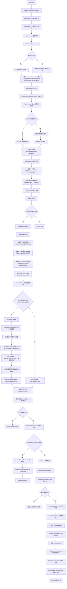

### 意图识别核心流程



# 意图识别核心流程详解（QA形式）

## Q1: 为什么要使用并行处理子问题的意图分类？

**A:** 
- **性能优化**：当用户问题被拆分成多个子问题时（如"考勤制度和处罚规则是什么"可能拆成两个子问题），串行处理会导致延迟累加
- **独立性强**：每个子问题的意图分类互不依赖，天然适合并行
- **线程池隔离**：使用专用的 `intentClassifyExecutor` 线程池，避免阻塞其他业务线程
- **异常隔离**：单个子问题分类失败不会影响其他子问题（catch后返回空列表降级）

---

## Q2: 为什么意图树要从 Redis 缓存加载，而不是直接从数据库查询？

**A:**
- **高频读取**：每次用户提问都要加载意图树，数据库查询会成为瓶颈
- **低频变更**：意图树配置变更频率低，适合缓存
- **双重保障**：Redis 不存在时自动从数据库加载并回写缓存，保证可用性
- **一致性权衡**：7天过期时间 + 管理后台更新时主动刷新，平衡一致性与性能

---

## Q3: 为什么只对所有"叶子节点"做意图分类，而不是整棵树？

**A:**

- **精确匹配**：叶子节点代表最细粒度的意图分类（如"人事 > 考勤制度 > 迟到处罚"），非叶子节点过于宽泛
- **减少LLM负担**：只传叶子节点可大幅减少 prompt 长度，降低 token 消耗和响应时间
- **避免歧义**：如果同时传入父节点和子节点，LLM 可能混淆应该选哪个层级
- **路径追溯**：叶子节点保留了 `fullPath` 字段，可以追溯到完整的分类路径

---

## Q4: INTENT_MIN_SCORE = 0.35 这个阈值是如何确定的？为什么需要过滤低分意图？

**A:**
- **噪声过滤**：低于 0.35 的意图通常是 LLM "强行匹配"的结果，参考价值低
- **防止误检索**：低分意图会导致检索到不相关的知识库，污染上下文
- **经验值调优**：通过大量测试用例（如 VectorTreeIntentClassifierTests）验证得出
- **动态调整空间**：不同业务场景可能需要调整，代码中保留为常量便于修改

---

## Q5: MAX_INTENT_COUNT = 3 的限制有什么考虑？为什么不是越多越好？

**A:**
- **成本控制**：每个意图对应一次向量检索，意图过多会导致：
  - Milvus 查询次数增加
  - Rerank 计算量暴增
  - 最终 prompt 过长，超出 LLM 上下文窗口
- **边际效益递减**：前 3 个高分意图通常覆盖了 90%+ 的相关性，后续意图贡献有限
- **响应速度**：限制意图数量保证端到端延迟在可接受范围内
- **注意力聚焦**：太多意图会让 LLM 难以聚焦核心信息，反而降低回答质量

---

## Q6: capTotalIntents 的裁剪策略为什么这么复杂？为什么不直接取全局 Top 3？

**A:**
这是最关键的设计点之一，原因在于：

**问题场景**：假设用户问了复合问题 "考勤怎么算和OA系统怎么用"，被拆成 2 个子问题：
- 子问题1："考勤怎么算" → 意图A(0.9), 意图B(0.8)
- 子问题2："OA系统怎么用" → 意图C(0.85), 意图D(0.7)

**如果直接取全局 Top 3**：会选中 A(0.9), C(0.85), B(0.8)，导致子问题2只有一个意图C，丢失了D的信息。

**当前策略的优势**：
1. **保底机制**：每个子问题至少保留最高分意图，确保所有子问题都被覆盖
2. **公平分配**：剩余配额按分数分配，兼顾整体最优
3. **语义完整性**：避免某个子问题被完全忽略

**实现逻辑**：

```
总意图数 = 2 + 2 = 4 > MAX_INTENT_COUNT(3)
步骤1: 每个子问题保底1个 → 选中A(0.9), C(0.85)
步骤2: 剩余配额 = 3 - 2 = 1
步骤3: 从剩余候选[B(0.8), D(0.7)]中选最高分 → 选中B(0.8)
最终结果: 子问题1有[A,B]，子问题2有[C]
```


---

## Q7: 为什么 LLM 调用时 temperature=0.1, topP=0.3，设置这么低的随机性？

**A:**
- **确定性优先**：意图分类是"理解用户意图"的任务，不需要创造性，需要稳定性
- **减少波动**：低温度保证相同问题多次调用得到一致的意图识别结果
- **JSON 格式要求**：LLM 必须输出严格的 JSON 格式，高温度容易导致格式错误
- **置信度可靠**：低温度下的 score 更能真实反映模型对意图匹配的确定程度

---

## Q8: 为什么 parse LLM 响应时要容错处理（如包裹在 {"results": [...]} 中）？

**A:**
- **模型不可控**：即使 prompt 明确要求输出数组，某些模型仍可能额外包裹对象
- **防御性编程**：避免因 LLM 输出格式微小变化导致整个流程崩溃
- **日志诊断**：解析失败时记录原始响应，便于排查问题和优化 prompt
- **优雅降级**：解析失败返回空列表，后续流程可以走"无意图检索"的兜底逻辑

---

## Q9: NodeScore 中为什么要保存完整的 IntentNode 对象，而不仅仅是 ID？

**A:**
- **避免二次查询**：后续流程需要频繁访问节点的属性（collectionName、promptSnippet、kind 等）
- **内存换性能**：IntentNode 对象不大，保存在内存中比每次都查数据库/Redis 快得多
- **数据一致性**：在一次请求生命周期内，确保使用的节点信息是一致的快照
- **支持离线操作**：即使 Redis/DB 短暂不可用，已加载的节点信息仍可正常使用

---

## Q10: 为什么 classifyIntents 失败时要降级返回空列表，而不是抛出异常？

**A:**
- **用户体验优先**：意图识别失败不应导致整个对话流程中断
- **兜底策略**：空意图列表会触发后续的"无意图定向检索"逻辑，仍能返回结果
- **局部故障隔离**：单个子问题失败不影响其他子问题的正常处理
- **日志追踪**：记录错误日志便于后续分析和优化，但不阻断主流程

---

## Q11: 为什么 isSystemOnly 判断条件是 nodeScores.size() == 1 且 kind == SYSTEM？

**A:**
- **精确匹配**：SYSTEM 类型意图通常是"打招呼"、"感谢"等无需检索的系统交互
- **避免误判**：如果有多个意图（即使包含 SYSTEM），说明用户问题可能有实质性内容
- **快速短路**：纯系统意图可以直接返回预设回复，跳过耗时的检索流程
- **典型场景**：
  - 用户说"你好" → 识别为 SYSTEM 意图 → 直接回复问候语
  - 用户说"谢谢 + OA系统怎么用" → 识别为 SYSTEM + KB 意图 → 走正常检索流程

---

## Q12: 整个意图解析链路的 Trace 埋点（@RagTraceNode）有什么作用？

**A:**
- **性能监控**：追踪 intent-resolve 阶段的耗时，定位性能瓶颈
- **问题诊断**：生产环境出现问题时，可以通过 traceId 回溯完整的意图识别过程
- **数据分析**：统计意图识别的成功率、平均耗时、常见失败模式等指标
- **可视化调试**：前端可以通过 trace 信息展示意图识别的中间结果，帮助管理员优化意图树配置

---

这些设计细节体现了 Ragent 在**性能、可靠性、可维护性**三个维度的深度思考，每个决策都是在实际业务场景中权衡得出的最佳实践。


让我深入分析意图树的设计结构和实现细节。


**已查看文件** *IntentNode.java*

**已检索仓库** *IntentNode entity class definition fields properties structure* 22 个结果


让我查看枚举定义和工厂类的完整实现：


**已查看文件** *IntentLevel.java*

**已查看文件** *IntentKind.java*

**已查看文件** *IntentTreeFactory.java 1-300*


完美！现在我可以为你详细解析意图树的设计了。让我用图文并茂的方式说明：

# 意图树设计详解（QA 形式）

---

### Q1: 意图树的层级结构是如何设计的？为什么是三层？

**A:** 意图树采用 **三层金字塔结构**：

```
Level 0 - DOMAIN（领域层）
├── Level 1 - CATEGORY（分类层）
│   └── Level 2 - TOPIC（主题层/叶子节点）
```


**示例结构：**
```
集团信息化 (DOMAIN)
├── 人事 (CATEGORY)
│   ├── 考勤制度 (TOPIC) ← 叶子节点，挂知识库
│   └── 请假流程 (TOPIC) ← 叶子节点，挂知识库
└── IT支持 (CATEGORY)
    ├── 打印机配置 (TOPIC) ← 叶子节点
    └── VPN连接 (TOPIC) ← 叶子节点

业务系统 (DOMAIN)
└── OA系统 (CATEGORY)
    ├── 系统介绍 (TOPIC) ← 叶子节点
    └── 数据安全 (TOPIC) ← 叶子节点
```


**为什么是三层？**
- **语义粒度递进**：从宽泛到具体，符合人类认知习惯
- **LLM 理解友好**：三层足够表达大多数企业场景的分类需求
- **性能平衡**：层数太多会增加维护成本，太少会导致分类不够精细
- **扩展性**：未来可以扩展到更多层，但三层已覆盖 90%+ 场景

---

### Q2: 三种 IntentKind（KB/SYSTEM/MCP）有什么区别？为什么要这样分类？

**A:** 这是意图树的**核心创新点**，将意图按"处理方式"分类：

| 类型       | 含义         | 处理方式                  | 典型场景         | 关键字段                       |
| ---------- | ------------ | ------------------------- | ---------------- | ------------------------------ |
| **KB**     | 知识库检索   | RAG 向量检索              | "考勤制度是什么" | collectionName                 |
| **SYSTEM** | 系统交互     | 直接回复预设话术          | "你好"、"你是谁" | promptTemplate                 |
| **MCP**    | 实时数据查询 | 调用 MCP 工具获取实时数据 | "今天销售额多少" | mcpToolId, paramPromptTemplate |

**设计优势：**
1. **统一意图入口**：无论什么类型的问题，都先经过意图识别
2. **差异化处理**：识别后立即分流到不同的处理链路
3. **可扩展性强**：新增一种处理方式只需增加一个 Kind 枚举
4. **避免资源浪费**：SYSTEM 类型无需检索，MCP 类型无需查知识库

---

### Q3: 为什么只有叶子节点才参与意图匹配？非叶子节点有什么用？

**A:** 这是一个关键的**设计决策**：

**叶子节点的特征：**
- `children` 为空或 null
- 挂载具体的知识库 Collection 或 MCP 工具
- 有详细的 description 和 examples
- 参与 LLM 意图打分

**非叶子节点的作用：**
1. **语义组织**：提供清晰的分类结构，便于管理员维护
2. **路径追溯**：通过 `fullPath` 字段展示完整分类路径（如"集团信息化 > 人事 > 考勤制度"）
3. **歧义消解**：在引导场景中，可以用父节点名称作为选项分组
4. **未来扩展**：预留了"层级检索"的可能性（虽然当前未实现）

**为什么不让非叶子节点参与匹配？**
- **避免模糊匹配**：如果用户问"人事相关问题"，匹配到"人事"这个 CATEGORY 节点太宽泛，无法确定具体检索哪个 Collection
- **减少 LLM 困惑**：同时传入父节点和子节点会让 LLM 难以选择
- **精确控制**：每个叶子节点对应明确的检索目标，保证结果可预测

---

### Q4: 节点的 examples 字段有什么作用？为什么对叶子节点特别重要？

**A:** examples 是**提升意图识别准确率的关键**：

**作用机制：**
```java
// 构建 LLM Prompt 时会包含 examples
sb.append("  examples=");
sb.append(String.join(" / ", node.getExamples()));
```


**生成的 Prompt 片段示例：**
```
- id=biz-oa-intro
  path=业务系统 > OA系统 > 系统介绍
  description=OA 系统整体功能说明、主要模块、典型使用场景
  examples=OA系统是做什么的？ / OA系统主要提供哪些功能？
  type=KB
```


**为什么重要？**
1. **Few-shot Learning**：给 LLM 提供典型样本，帮助它理解这个意图的边界
2. **语义锚点**：examples 中的词汇会成为 LLM 判断的参考依据
3. **降低误判**：没有 examples 时，LLM 可能把"OA系统登录问题"误判为"系统介绍"
4. **可解释性**：管理员可以通过查看 examples 快速理解每个意图的含义

**最佳实践：**
- 每个叶子节点至少配置 3-5 个 examples
- 覆盖不同的问法（同义句、口语化表达）
- 定期根据日志中的误判案例补充 examples

---

### Q5: collectionName 和 kbId 的区别是什么？为什么需要两个字段？

**A:** 这两个字段服务于**不同层级**的需求：

**kbId（知识库 ID）：**
- 指向 t_knowledge_base 表的主键
- 用于前端展示、权限控制、统计报表
- 一个知识库可以包含多个 Collection（虽然当前是一对一）
- 示例：`"1997855927072321537"`

**collectionName（Milvus 集合名）：**
- 直接对应 Milvus 向量数据库中的 Collection 名称
- 用于实际的向量检索操作
- 与 Milvus 的物理存储一一对应
- 示例：`"group_hr_attendance"`

**为什么需要两个？**
```
业务层（kbId）          技术层（collectionName）
┌─────────────┐        ┌──────────────────┐
│ 知识库ID     │ ────→  │ Milvus Collection│
│ 用于：       │        │ 用于：            │
│ - 权限校验   │        │ - 向量检索        │
│ - 数据统计   │        │ - 索引管理        │
│ - 前端展示   │        │ - 分片策略        │
└─────────────┘        └──────────────────┘
```


**解耦的好处：**
- 修改 Collection 名称不影响业务逻辑
- 可以实现"一个知识库对应多个 Collection"的场景
- 便于迁移向量数据库（只需改 collectionName 映射）

---

### Q6: promptSnippet、promptTemplate、paramPromptTemplate 三个提示词字段有什么区别？

**A:** 这三个字段分别服务于**不同的提示词场景**：

| 字段                    | 用途         | 使用时机                                    | 示例                                    |
| ----------------------- | ------------ | ------------------------------------------- | --------------------------------------- |
| **promptSnippet**       | 回答规则片段 | 拼接到最终 RAG Prompt 中，指导 LLM 如何回答 | "回答时不要提及具体人名"                |
| **promptTemplate**      | 完整对话模板 | SYSTEM 类型意图或特殊场景的独立对话         | 欢迎语的完整回复模板                    |
| **paramPromptTemplate** | 参数提取模板 | MCP 类型意图，从用户问题中提取工具参数      | "从'查询张三的销售数据'中提取姓名=张三" |

**实际应用场景：**

**场景1：KB 节点使用 promptSnippet**
```java
// 节点配置
promptSnippet = "回答时使用表格格式展示考勤规则"

// 最终拼接到 RAG Prompt
#### 回答规则
1. 回答时使用表格格式展示考勤规则

#### 知识库片段
...检索到的文档内容...
```


**场景2：SYSTEM 节点使用 promptTemplate**
```java
// 节点配置
promptTemplate = "你好！我是Ragent智能助手，可以帮你查询公司制度、IT支持等信息。请问有什么可以帮您的？"

// 直接返回给用户，不走 RAG 流程
```


**场景3：MCP 节点使用 paramPromptTemplate**
```java
// 节点配置
paramPromptTemplate = "从用户问题中提取销售查询参数：\n- 时间范围（today/week/month）\n- 销售人员姓名\n- 产品类型"

// 调用 MCP 工具前先用此模板提取参数
```


---

### Q7: topK 字段为什么要放在节点级别？全局 TopK 不够用吗？

**A:** 节点级 TopK 是为了**精细化控制检索质量**：

**问题场景：**
- 某些意图对应的知识库文档很少（如"发票抬头"只有 3 条记录），设置 topK=10 会返回大量不相关内容
- 某些意图需要更全面的上下文（如"系统架构"），topK=10 可能不够

**解决方案：**
```java
// 节点配置
IntentNode node = IntentNode.builder()
    .id("group-finance-invoice")
    .name("发票相关")
    .topK(5)  // 只返回最相关的 5 条
    .build();

IntentNode node2 = IntentNode.builder()
    .id("biz-ins-arch")
    .name("架构设计")
    .topK(15)  // 需要更多上下文
    .build();
```


**优先级逻辑：**
```java
private int resolveSubQuestionTopK(SubQuestionIntent intent, int fallbackTopK) {
    return NodeScoreFilters.kb(intent.nodeScores()).stream()
        .map(NodeScore::getNode)
        .map(IntentNode::getTopK)
        .filter(Objects::nonNull)
        .findFirst()
        .orElse(fallbackTopK);  // 节点未配置则回退全局默认值
}
```


**优势：**
- **灵活性**：不同意图可以有不同的检索策略
- **成本控制**：减少不必要的向量检索和 Rerank 计算
- **质量优化**：针对特定场景调优检索数量

---

### Q8: fullPath 字段是如何计算的？为什么需要预计算而不是运行时拼接？

**A:** fullPath 是在**构建树时递归计算**的：

**计算逻辑：**
```java
private void fillFullPath(List<IntentNode> nodes, IntentNode parent) {
    for (IntentNode node : nodes) {
        if (parent == null) {
            node.setFullPath(node.getName());  // 根节点
        } else {
            node.setFullPath(parent.getFullPath() + " > " + node.getName());
        }
        
        if (node.getChildren() != null && !node.getChildren().isEmpty()) {
            fillFullPath(node.getChildren(), node);  // 递归处理子节点
        }
    }
}
```


**生成的 fullPath 示例：**
```
节点ID: group-hr              → fullPath: "集团信息化 > 人事"
节点ID: biz-oa-intro          → fullPath: "业务系统 > OA系统 > 系统介绍"
节点ID: sales-data            → fullPath: "销售汇总数据统计 > 销售数据统计"
```


**为什么预计算？**
1. **高频读取**：每次构建 LLM Prompt 都要用到，预计算避免重复拼接
2. **一致性保证**：运行时拼接可能因并发修改导致不一致
3. **调试友好**：日志中可以直接打印 fullPath，便于排查问题
4. **前端展示**：意图树管理页面需要显示完整路径

---

### Q9: 意图树是如何持久化的？数据库设计和内存结构有什么关系？

**A:** 采用**扁平化存储 + 树形重建**的策略：

**数据库表结构（t_intent_node）：**
```sql
CREATE TABLE t_intent_node (
    id VARCHAR PRIMARY KEY,           -- 主键（雪花算法生成）
    intent_code VARCHAR UNIQUE,       -- 业务唯一标识（如 "group-hr"）
    name VARCHAR,                     -- 展示名称
    level INTEGER,                    -- 层级（0/1/2）
    parent_code VARCHAR,              -- 父节点的 intent_code
    description TEXT,                 -- 描述
    examples TEXT,                    -- JSON 数组字符串
    collection_name VARCHAR,          -- Milvus Collection 名
    mcp_tool_id VARCHAR,              -- MCP 工具 ID
    kind INTEGER,                     -- 类型（0=KB, 1=SYSTEM, 2=MCP）
    top_k INTEGER,                    -- 节点级 TopK
    prompt_snippet TEXT,              -- 回答规则片段
    prompt_template TEXT,             -- 完整提示词模板
    param_prompt_template TEXT,       -- 参数提取模板
    sort_order INTEGER,               -- 排序
    enabled INTEGER,                  -- 是否启用
    ...
);
```


**加载流程：**
```
数据库（扁平结构）
┌─────────────────────────────────┐
│ id | intent_code | parent_code  │
├─────────────────────────────────┤
│ 1  | group       | NULL         │
│ 2  | group-hr    | group        │
│ 3  | biz         | NULL         │
└─────────────────────────────────┘
         ↓ loadIntentTreeFromDB()
内存（树形结构）
┌─────────────────────────────────┐
│ IntentNode (group)              │
│   children: [                   │
│     IntentNode (group-hr)       │
│   ]                             │
└─────────────────────────────────┘
         ↓ saveIntentTreeToCache()
Redis 缓存（JSON 序列化）
{"id":"group","children":[...]}
```


**关键代码：**
```java
// 第二遍：根据 parentId 组装 parent -> children
for (IntentNode node : id2Node.values()) {
    String parentId = node.getParentId();
    IntentNode parent = id2Node.get(parentId);
    if (parent != null) {
        parent.getChildren().add(node);
    } else {
        roots.add(node);  // 找不到父节点，当作根节点
    }
}
```


**设计优势：**
- **数据库查询简单**：一次 SELECT 查出所有节点
- **树形关系灵活**：通过 parent_code 维护，易于调整层级
- **缓存友好**：整棵树序列化为 JSON 存入 Redis
- **容错性强**：父节点缺失时自动降级为根节点，避免数据丢失

---

### Q10: 意图树的初始化流程是怎样的？Factory 模式有什么好处？

**A:** 提供了**两种初始化方式**：

**方式1：Factory 硬编码初始化（开发/测试环境）**
```java
// IntentTreeFactory.buildIntentTree()
IntentNode group = IntentNode.builder()
    .id("group")
    .name("集团信息化")
    .level(DOMAIN)
    .build();
// ... 手动构建整棵树

// 批量插入数据库
intentTreeService.initFromFactory();
```


**方式2：管理后台动态配置（生产环境）**
```
前端表单 → API → 数据库 → Redis 缓存
```


**Factory 模式的好处：**
1. **快速启动**：新环境部署时一键初始化默认意图树
2. **版本控制**：意图树结构可以通过代码管理，便于 review 和回滚
3. **文档化**：代码本身就是最好的文档，清晰展示意图树结构
4. **测试便利**：单元测试可以直接使用 Factory 构建测试数据

**生产环境建议：**
- 首次部署时用 Factory 初始化
- 后续通过管理后台动态调整
- 重大变更时更新 Factory 代码并重新同步到数据库

---

### Q11: 意图树如何处理多租户/多知识库场景？

**A:** 通过 **kbId 字段实现隔离**：

**场景示例：**
```
租户A（集团总部）
├── kbId = "kb_group_001"
│   ├── 集团信息化 > 人事
│   └── 集团信息化 > 财务

租户B（子公司）
├── kbId = "kb_sub_002"
│   ├── 子公司制度 > 考勤
│   └── 子公司制度 > 报销
```


**检索时的隔离逻辑：**
```java
// 根据意图节点的 kbId 过滤检索范围
RetrieveRequest request = RetrieveRequest.builder()
    .collectionName(node.getCollectionName())
    .query(question)
    .build();

// Milvus Collection 本身已经按租户隔离
// 或者在查询时添加元数据过滤条件
```


**扩展方案：**
- 可以在 IntentNode 中增加 `tenantId` 字段
- 或在加载意图树时根据当前用户权限过滤节点
- 或在检索时动态注入租户过滤条件

---

### Q12: 意图树的演进路线是什么？未来可以如何优化？

**A:** 当前设计已经非常完善，未来可以考虑以下优化方向：

**短期优化（1-3个月）：**
1. **意图热度统计**：记录每个节点的命中次数，优化热门意图的检索策略
2. **自动推荐 examples**：基于用户真实提问，自动补充高频问法到 examples
3. **意图冲突检测**：检测两个意图的 examples 是否有重叠，提醒管理员优化

**中期优化（3-6个月）：**
4. **动态权重调整**：根据历史准确率，自动调整节点的 score 阈值
5. **多级缓存**：除了 Redis 缓存整棵树，还可以缓存单个节点的 embedding
6. **意图迁移工具**：支持批量移动节点、合并意图等操作

**长期优化（6-12个月）：**
7. **自适应层级**：根据数据量自动调整树的深度（如某个 CATEGORY 下文档太多，自动拆分为多个 TOPIC）
8. **跨语言支持**：支持中英文混合意图识别
9. **意图图谱**：建立意图之间的关联关系（如"考勤"和"请假"强相关），用于联想推荐

---

## 总结

Ragent 的意图树设计体现了**分层抽象、职责分离、灵活扩展**的核心思想：

- **三层结构**平衡了语义粒度和维护成本
- **三种 Kind**实现了差异化的处理策略
- **丰富的元数据**（examples/prompt/topK）提升了识别准确率
- **扁平存储 + 树形重建**兼顾了查询效率和灵活性

这套设计不仅适用于当前的 RAG 场景，也为未来的 Agentic AI 应用奠定了坚实的基础。